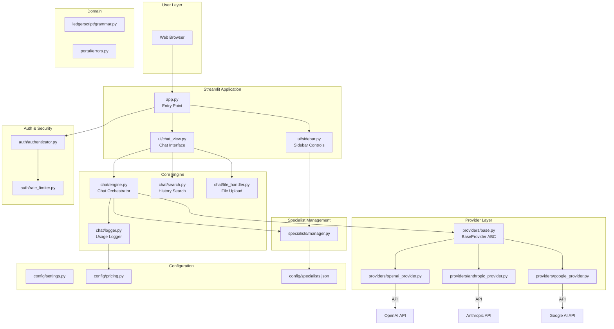
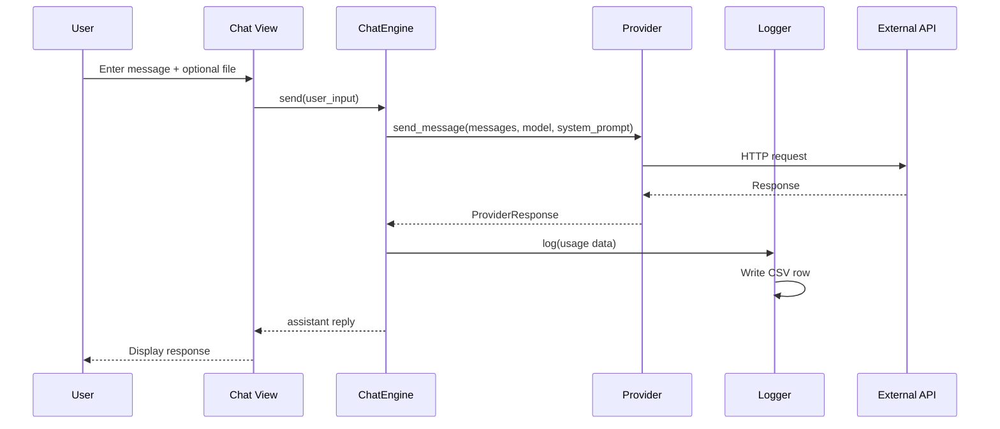

# Architecture Overview

## System Diagram



## Component Descriptions

### Entry Point
- **`app.py`** — Streamlit entry point. Initialises session state, authenticates the user, renders sidebar + chat view.

### UI Layer
- **`ui/chat_view.py`** — Main chat interface with message history, file upload widget, conversation search, timestamps, token info display, and regenerate button.
- **`ui/sidebar.py`** — Specialist selector (with pinning), specialist management (create/edit/duplicate/delete), conversation controls, and status panel.

### Core Engine
- **`chat/engine.py`** — Orchestrates conversations. Manages message history, delegates to providers, logs usage. Supports both synchronous (`send`) and streaming (`send_streaming`) modes.
- **`chat/search.py`** — Case-insensitive substring search across chat history ranked by recency.
- **`chat/file_handler.py`** — Processes uploaded files into `ChatAttachment` objects. Validates extensions/size, extracts text from PDFs, base64-encodes content.
- **`chat/logger.py`** — Appends per-request usage rows to daily CSV files. Provides specialist-level aggregation via `get_specialist_stats()`.

### Provider Layer
- **`providers/base.py`** — Abstract `BaseProvider` defining the contract: `send_message()`, `stream_message()`, `count_tokens()`, `get_available_models()`, `format_attachment()`.
- **`providers/openai_provider.py`** — OpenAI/Grok implementation. Images sent as `image_url` content blocks.
- **`providers/anthropic_provider.py`** — Anthropic Claude implementation. Images as `image` blocks, PDFs as `document` blocks.
- **`providers/google_provider.py`** — Google Gemini implementation. All files as `Part.from_data()` dicts.

### Specialist Management
- **`specialists/manager.py`** — CRUD for specialist configurations (JSON persistence). Supports duplicate, pin/unpin, sorted listing.

### Auth & Security
- **`auth/authenticator.py`** — Email/password authentication with session management.
- **`auth/rate_limiter.py`** — Token-bucket rate limiting per user/session.

### Configuration
- **`config/settings.py`** — Global constants (timeouts, defaults, log directory).
- **`config/pricing.py`** — Per-model token pricing table and `estimate_cost()`.
- **`config/specialists.json`** — Bundled specialist definitions.

### Domain
- **`ledgerscript/grammar.py`** — LedgerScript DSL grammar parser.
- **`portal/errors.py`** — Typed exception hierarchy (`PortalError` → `ProviderAPIError`, `AuthenticationError`, `RateLimitError`, `ValidationError`).

## Data Flow



## Test Architecture

```
tests/
├── conftest.py           # Shared fixtures (StubProvider, attachments, etc.)
├── unit/                 # Fast, isolated unit tests (227 tests)
├── integration/          # Multi-component workflow tests (21 tests)
├── live/                 # Real API tests (skipped without keys)
└── performance/          # Benchmarks with time assertions
```

## Technology Stack

| Component | Technology |
|-----------|-----------|
| Framework | Streamlit ≥1.30.0 |
| Language | Python 3.10+ |
| LLM Providers | OpenAI, Anthropic, Google Generative AI |
| PDF Processing | pdfplumber |
| Testing | pytest |
| Deployment | Docker, Streamlit Cloud |
